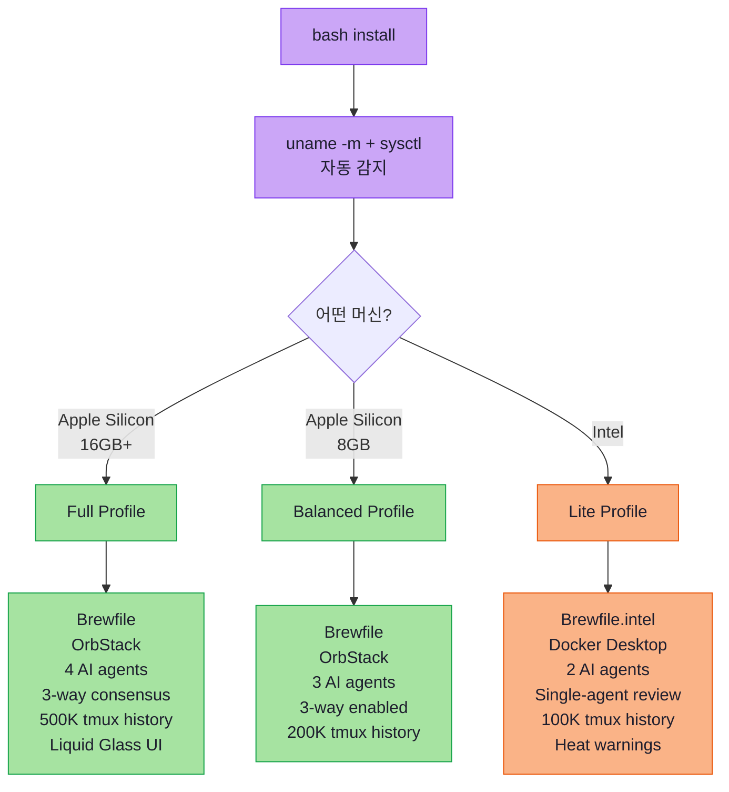
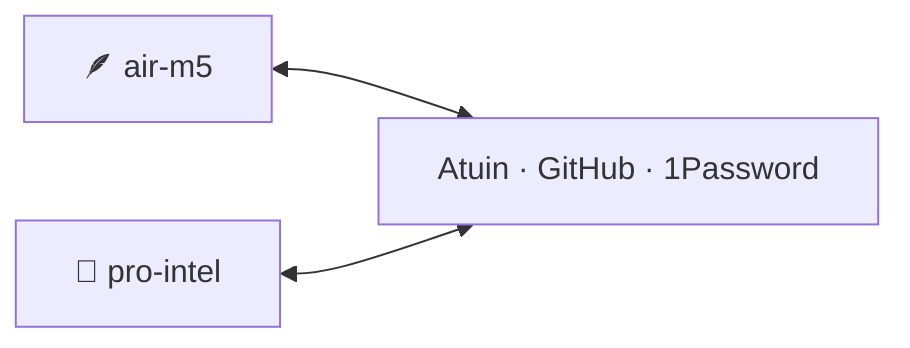

# 🚀 dotfiles

> **Multi-Agent Dev Environment** for macOS · Single-line setup
> Auto-detects Apple Silicon (M1~M5+) **and** Intel Macs
> Ghostty · tmux · Claude Code · Codex CLI · Gemini CLI · AeroSpace

[](scripts/pre-push-qa.sh)
[](https://github.com/0xOrOi0x/dotfiles)
[](https://www.apple.com/macos/)
[](https://en.wikipedia.org/wiki/Apple_silicon)
[](docs/INTEL_MAC_GUIDE.md)
[](LICENSE)

---

## 🪄 한 줄 설치

```bash
sh -c "$(curl -fsSL https://raw.githubusercontent.com/0xOrOi0x/dotfiles/main/install)"
```

**그게 다입니다.** 같은 명령어가 모든 머신에서 작동:

| 머신 | 자동 감지 결과 |
|:---|:---|
| 🪶 MacBook Air M5 (24GB) | `air-m5` profile=`full`, AI=4 concurrent |
| 💪 MacBook Pro 2019 (Intel i9 16GB) | `pro-intel` profile=`lite`, AI=2 concurrent |
| 🪶 MacBook Pro M3 Max (36GB) | `pro-m3` profile=`full`, AI=4 concurrent |
| 🪶 Mac mini M4 (16GB) | `mini-m4` profile=`full`, AI=4 concurrent |
| ... | 모든 Mac 자동 감지 |

설치 시간:
- Apple Silicon: **~22분**
- Intel: **~50분**

---

## 🎯 자동 적용되는 머신별 최적화



---

## 📦 설치되는 것들

<details>
<summary><b>🐚 Shell & Terminal</b> (펼치기)</summary>

- **[Ghostty](https://ghostty.org)** — GPU-accelerated terminal (Universal binary)
- **tmux** with resurrect/continuum — persistent sessions
- **[Starship](https://starship.rs)** — Rust prompt (Catppuccin Mocha)
- **Oh My Zsh** + **Zinit** — plugin manager
- **[Atuin](https://atuin.sh)** — encrypted shell history sync
- **direnv** + **mise** — env + runtime management
</details>

<details>
<summary><b>🛠️ Modern CLI (20+ tools)</b></summary>

`lsd` `bat` `fd` `ripgrep` `fzf` `zoxide` `lazygit` `delta` `glow` `btop` `tokei` `hyperfine` `jless` `httpie` `gron` `jq` `yq` `navi` `marp-cli` `pandoc` `mermaid-cli`
</details>

<details>
<summary><b>🤖 AI Coding Agents</b></summary>

- **Claude Code** (Anthropic) — Plan Mode + Subagents + Hooks
- **Codex CLI** (OpenAI) — multi_agent_v2
- **Gemini CLI** (Google) — 1M context
- **OMC plugin** — multi-agent workflow modes
</details>

<details>
<summary><b>🪟 Window Management</b></summary>

- **AeroSpace** — i3-style tiling (Apple Silicon optimized, Intel compatible)
- **Karabiner-Elements** — Caps Lock → Hyper Key
- **Raycast** — Spotlight + AI launcher
</details>

<details>
<summary><b>🔐 Security & Productivity</b></summary>

- **1Password CLI + SSH Agent** — secure key + secret management
- **OrbStack** (Apple Silicon) / **Docker Desktop** (Intel) — containers
- **chezmoi** — declarative dotfiles
- **Bruno** — git-friendly API testing
</details>

---

## 🎯 설치 후 첫 단계

```bash
# 1. 셸 재시작
exec zsh

# 2. 머신 프로필 확인
dot-info

# 3. AI 에이전트 인증
claude          # Anthropic
codex login     # OpenAI
gemini          # Google

# 4. tmux 플러그인
tmux            # then Ctrl+Space → Shift+I

# 5. Atuin 동기화
atuin register -u <USER> -e <EMAIL>     # 첫 머신
atuin login -u <USER>                   # 다른 머신
# ⚠️ 암호화 키 1Password에 저장!

# 6. 권한 부여
# 시스템 설정 → 손쉬운 사용 → AeroSpace, Karabiner, Raycast

# 7. 1Password SSH Agent
# 1Password 앱 → Settings → Developer → Use SSH Agent
op signin

# 8. 검증
dot-verify
```

---

## ⌨️ 일상 명령어

```bash
# 🎼 Multi-agent
cockpit <feature> "<task>"     # 4-pane cockpit (full) / 3-pane (lite)
status                          # all worker progress
agents                          # fzf jump to active sessions
review <PR>                     # 3-way consensus (full) / single-agent (lite)
plan "<idea>"                   # Claude Plan Mode
cc-check                        # headless build verification
cleanup-wt <feature>            # cleanup worktree

# 📜 Dotfiles
dot                             # cd ~/.dotfiles
dot-info                        # 머신 프로필 표시
dot-edit <file>                 # chezmoi edit
dot-apply                       # chezmoi apply
dot-update                      # full update (repo + brew + AI)
dot-verify                      # health check

# 🌡 System
sysmon                          # resource monitor (Intel especially)
tools                           # fzf launcher
```

### Ghostty
- `Cmd+D` / `Cmd+Shift+D` — split
- `Cmd+Alt+arrows` — navigate panes
- `Cmd+Shift+Enter` — zoom
- `Cmd+1~5` — tabs

### tmux (Prefix = `Ctrl+Space`)
- `Prefix+S` — STATUS popup
- `Prefix+A` — AGENTS.md popup
- `Prefix+R` — review results
- `Prefix+W` — worktree jump
- `Prefix+G` — lazygit popup
- `Prefix+I` — info popup (machine ID)

### AeroSpace (`Alt` = Option)
- `Alt+1~5` — workspaces
- `Alt+H/J/K/L` — focus
- `Alt+Shift+1~5` — move window
- `Alt+/` — layout toggle

---

## 🖥️ Two-Machine Setup

이 dotfiles는 **2대 이상의 Mac을 동기화**하도록 설계되었습니다:



자세한 가이드: [`docs/TWO_MACHINE_SETUP.md`](docs/TWO_MACHINE_SETUP.md)

### Sync Layers

1. **dotfiles** — `chezmoi` + GitHub
2. **Shell history** — Atuin (E2E encrypted)
3. **Secrets** — 1Password (SSH keys + API keys)
4. **Code** — Git + GitHub

### Optional: Home Server Mode

Intel Mac을 항상 켜둔 홈 서버로 변환 (Tailscale + sshd):

```bash
bash ~/.dotfiles/scripts/enable-home-server.sh
```

---

## 🏗️ 아키텍처

```
┌──────────────────────────────────────────────────┐
│ L7  AeroSpace (workspaces 1-5)                   │
├──────────────────────────────────────────────────┤
│ L6  Ghostty (GPU, profile-tuned transparency)    │
├──────────────────────────────────────────────────┤
│ L5  tmux (persistent) + Atuin (history sync)     │
├──────────────────────────────────────────────────┤
│ L4  zsh + Oh My Zsh + Zinit + Starship           │
├──────────────────────────────────────────────────┤
│ L3  Modern CLI (20+ tools)                       │
├──────────────────────────────────────────────────┤
│ L2  Claude · Codex · Gemini (auto-tuned count)   │
├──────────────────────────────────────────────────┤
│ L1  1Password SSH Agent · direnv · gnupg         │
├──────────────────────────────────────────────────┤
│ L0  Homebrew · chezmoi · mise                    │
├──────────────────────────────────────────────────┤
│ Auto-Detect: machine-detect.sh → arch/RAM/profile│
└──────────────────────────────────────────────────┘
```

---

## 🔄 일상 운영

```bash
# 매일 아침 (자동 동기화)
open -a Ghostty            # tmux-continuum 자동 복원
status                     # 어제 진행률 확인

# 매주 월요일 (5분)
dot-update                 # 모든 도구 업데이트

# 새 머신 셋업 (30분)
sh -c "$(curl -fsSL https://raw.githubusercontent.com/0xOrOi0x/dotfiles/main/install)"
atuin login                # 히스토리 복원
op signin                  # 1Password
# 끝.
```

---

## 📁 Repo 구조

```
dotfiles/
├── install                       # 한 줄 진입점
├── bootstrap.sh                  # 메인 설치 (10 phases, machine-aware)
├── Brewfile                      # Apple Silicon
├── Brewfile.intel                # Intel Mac (auto-selected)
├── .chezmoiroot                  # → home/
├── .chezmoi.toml.tmpl            # 머신 자동 감지
├── home/                         # chezmoi-managed dotfiles
│   ├── dot_zshrc.tmpl            # 프로필별 함수 분기
│   ├── dot_tmux.conf.tmpl        # 히스토리 차등
│   ├── dot_gitconfig.tmpl
│   ├── dot_config/
│   │   ├── ghostty/config.tmpl   # 투명도 차등 (Liquid Glass for full)
│   │   ├── starship.toml
│   │   ├── aerospace/aerospace.toml
│   │   ├── karabiner/karabiner.json
│   │   ├── atuin/config.toml
│   │   └── direnv/direnvrc
│   ├── dot_claude/
│   ├── dot_codex/
│   └── private_dot_ssh/config.tmpl  # 1Password SSH Agent
├── scripts/
│   ├── machine-detect.sh         # 🆕 자동 감지
│   ├── verify.sh                 # 🆕 머신 프로필 표시
│   ├── update.sh
│   ├── nuke.sh
│   ├── macos-defaults.sh
│   ├── pre-push-qa.sh
│   ├── post-push-verify.sh
│   └── enable-home-server.sh     # 🆕 Tailscale opt-in
├── docs/
│   ├── INTEL_MAC_GUIDE.md        # 🆕
│   └── TWO_MACHINE_SETUP.md      # 🆕
└── README.md
```

---

## 🛡️ 보안

- **시크릿 절대 commit 금지** — `.gitignore`에 `.env`, `*.pem`, `*.key` 등록됨
- **1Password SSH Agent** — 키가 vault에 보관, 머신 간 자동 동기화
- **direnv** — 프로젝트별 시크릿을 1Password에서 동적 로드
- **Atuin history filter** — API 키 패턴 자동 필터링
- **Claude Code hook** — 비밀키 패턴 자동 차단

---

## 🐛 트러블슈팅

| 증상 | 해결 |
|:---|:---|
| `command not found: brew` | `eval "$(/opt/homebrew/bin/brew shellenv)"` (또는 `/usr/local/bin`) |
| `cockpit` 함수 없음 | `exec zsh` |
| AeroSpace 동작 X | 시스템 설정 → 손쉬운 사용 |
| 한글 깨짐 | Ghostty config의 두 번째 `font-family` 확인 |
| Intel에서 발열 | `sysmon` 실행 → `dot-update` |
| Brewfile 잘못 선택됨 | `bash bootstrap.sh --reset && bash bootstrap.sh` |
| 머신 프로필 잘못됨 | `chezmoi init --source ~/.dotfiles` 재실행 |

자세한 헬스체크: `dot-verify`

Intel Mac 전용 가이드: [`docs/INTEL_MAC_GUIDE.md`](docs/INTEL_MAC_GUIDE.md)

---

## 📝 라이선스

MIT © 2026 [박승호 (Liam Park)](https://github.com/0xOrOi0x)

---

## 🙏 영감

- [DND 기술 블로그 — 2026 Mac 터미널 완벽 세팅](https://blog.dnd.ac/settings-mac-terminal-2026/)
- [agents.md](https://agents.md) — AI 에이전트 인스트럭션 표준

---

> *"Two machines, one command, zero friction."*
